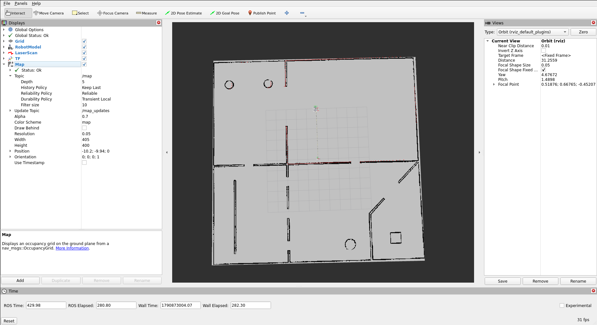
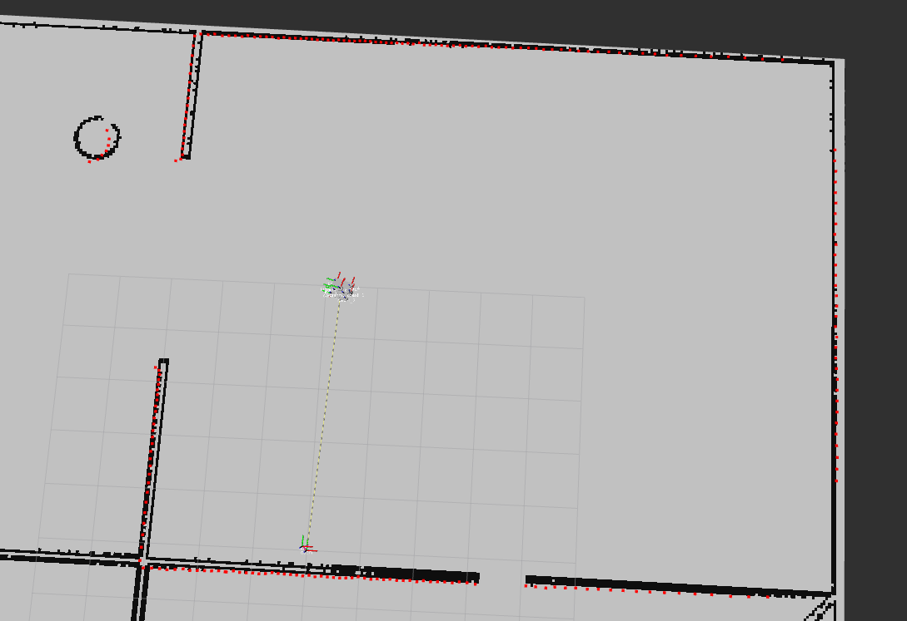
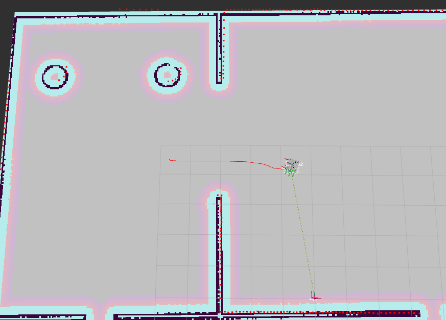

# Level 1: ROS2 Navigation Assignment - Himanshu Suresh Rokade

## Repository Structure

```
ros_nav2_assignment/
├── testbed_description/
│   ├── launch/            # Launch the full base simulation
│   ├── meshes/
│   ├── rviz/            # RVIZ configuration files
│   └── urdf/            # URDF files for Testbed-T1.0.0
├── testbed_gazebo/
│   ├── worlds/            # Simulation world files
│   ├── launch/            # Launch files for Gazebo
│   └── models/            # Misc. Gazebo model files
├── testbed_bringup/
│   ├── launch/            # Launch file for bringing up the robot
│   └── maps/              # Predefined map of the test environment
├── testbed_navigation/
│   ├── launch/            # Launch the full base simulation
└── README.md              # Instructions for the assignment
```

## Debugging the Workspace

### Problem 1
I have Ubuntu 24.04 installed with ROS2 Jazzy, So I created a docker container of ros:humble using below command.
'''
docker run -it --name humble_nav \
  --net=host --privileged \
  -e DISPLAY=$DISPLAY \
  -e RMW_IMPLEMENTATION=rmw_cyclonedds_cpp \
  -v /tmp/.X11-unix:/tmp/.X11-unix \
  -v ~/assignment_ws:/root/assignment_ws \
  osrf/ros:humble-desktop bash
'''

### Problem 2
While building workspace first error is:
'''
--- stderr: testbed_bringup
CMake Error: The current CMakeCache.txt directory /root/assignment_ws/build/testbed_bringup/CMakeCache.txt is different than the directory /home/himanshu/assignment_ws/build/testbed_bringup where CMakeCache.txt was created. This may result in binaries being created in the wrong place. If you are not sure, reedit the CMakeCache.txt
CMake Error: The source "/root/assignment_ws/src/level01_ros_assignment/testbed_bringup/CMakeLists.txt" does not match the source "/home/himanshu/assignment_ws/src/level01_ros_assignment/testbed_bringup/CMakeLists.txt" used to generate cache.  Re-run cmake with a different source directory.
---
'''
it is because I am in the docker container, so I have removed the build, install and log folders from workspace.
'''
cd ~/assignment_ws
rm -rf build install log
'''

### Problem 3
Again while building the workspace I got another error as:
'''
--- stderr: testbed_description
CMake Error at CMakeLists.txt:24:
  Parse error.  Expected "(", got newline with text "
  ".
---
'''
this is because the missing of brackets in the CMakeLists.txt in description pkg.
'''
ament_package()
'''

### Problem 4
Now I found another problem that when I launch the testbed_full_bringup file, I was not able to see the lidar mapping in rviz window. So I check the LaserScan topic in rviz window and it is showing messages received, then I check the lidar plugin in the urdf xacro and gazebo file and I found that the max range of lidar is only 1.5m so I change it to 10m.
'''
<range>
  <min>0.10</min>
  <max>10.0</max>
  <resolution>0.01</resolution>
</range>
'''
Now I can see the mapping of LaserScan.

Note: Before going towards Navigation i tested the movement of the robot using:
'''
ros2 run teleop_twist_keyboard teleop_twist_keyboard
'''
The robot was moving correctly.

## Developing ROS2 Navigation

### Step1
Create navigation pakage
'''
ros2 pkg create --build-type ament_cmake testbed_navigation
'''
### Step 2
As mentioned that not to use nav2brigup directly and individual launch files for each task.
So firstly i create launch folder in navigation pkg and starts with map_server by creating launch file 
'''
map_loader.launch.py
'''
It contains the map_server and lifcycle node to handle the map_server to run it contineously even if it stops.The testbed_world.yaml is used in this pkg from the bringup pkg and then update the CMakeList.txt and package.xml

now launch the map_server
'''
ros2 launch testbed_navigation map_loader.launch.py
'''
It retuns an error as
'''
[map_server-1] [ERROR] [1790867784.313877780] [map_io]: Failed processing YAML file /root/assignment_ws/install/testbed_bringup/share/testbed_bringup/maps/testbed_world.yaml at position (-1:-1) for reason: bad file: /root/assignment_ws/install/testbed_bringup/share/testbed_bringup/maps/testbed_world.yaml
'''
Then i check the yaml file but not able to find problem then i check CMakeList.txt of bringup pkg and found it that the maps folder is not installed.
'''
install(
  DIRECTORY
    launch maps
  DESTINATION
    share/${PROJECT_NAME}/
)
'''
then i launch it again and found another error as
'''
[map_server-1] [ERROR] [1790868512.847008091] [map_io]: Failed to load image file /root/assignment_ws/install/testbed_bringup/share/testbed_bringup/maps/wrong_path_testbed_world.pgm for reason: Magick: Unable to open file (/root/assignment_ws/install/testbed_bringup/share/testbed_bringup/maps/wrong_path_testbed_world.pgm) reported by magick/blob.c:3089 (OpenBlob)
'''
so i check the yaml file and found another problem at image name so i correct it
'''
image: testbed_world.pgm
'''
then it launch without any error and then i check the lifecycle node
'''
root@ASUS-ROG-Strix:/# ros2 lifecycle nodes 
/map_server
root@ASUS-ROG-Strix:/# ros2 lifecycle get /map_server
active [3]
'''
then i launch the robot
'''
ros2 launch testbed_bringup testbed_full_bringup.launch.py 
'''
Then added map visualization, and the map is not showing then i check the QOS policies of the /map topic and found it
'''
ros2 topic info -v /map
Type: nav_msgs/msg/OccupancyGrid

Publisher count: 1

Node name: map_server
Node namespace: /
Topic type: nav_msgs/msg/OccupancyGrid
Endpoint type: PUBLISHER
GID: 01.10.f9.d9.db.8c.c2.47.ee.96.cc.c1.00.00.23.03.00.00.00.00.00.00.00.00
QoS profile:
  Reliability: RELIABLE
  History (Depth): KEEP_LAST (1)
  Durability: TRANSIENT_LOCAL
  Lifespan: Infinite
  Deadline: Infinite
  Liveliness: AUTOMATIC
  Liveliness lease duration: Infinite
'''
Then i change the Durability policy to TRANSIENT_LOCAL and the map is showing.


### Step 3
Now creating amcl localization for that i make a config folder for yaml file of amcl and added it in CMakeList.txt and also added dependencies in package.xml
'''
amcl_params.yaml
'''
where the amcl parameters are defined the reference is taken from my previous workspaces. Then created localization launch file
'''
localization.launch.py
'''
It contains amcl node and lifecycle node for it, and then launch the amcl
'''
ros2 launch testbed_navigation localization.launch.py 
'''
and then i test the amcl by running telelop.
'''
ros2 run teleop_twist_keyboard teleop_twist_keyboard
'''
and the robot lidar scan was alining itself with the map.


### Step 4
Now finally creating navigation launch file with bt navigatior, controller, planner, local & global costmaps, smoother, behaviour servers config files
'''
controller_server - contains parameter for pure pursuit controller which moves the robot
planner_server - contains parameter for grid based path planner
local_costmap - contains obstacle and inflation layers for local costmap
global_costmap - contains static, obstacle, inflation layer for global costmap
smoother_server - it smoothout the planned path by planner
bt_navigator - it is for the behaviour tree
behavior_server - it handles the recovery actions if goal failed.
'''
then i launch the navigation launch file and added visulaization of global and local costmap in rviz. 

Finally the robot is started to moving autonously as shown below images

(media/test2.png)


## How to run it
'''
cd ~/assignment_ws
colcon build
'''
Termial 1
'''
~/assignment_ws
source install/setup.bash
ros2 launch testbed_bringup testbed_full_bringup.launch.py 
'''
Termial 2
'''
~/assignment_ws
source install/setup.bash
ros2 launch testbed_navigation bringup_navigaition.launch.py
'''
Select 2D Goal Pose and pin the goal on the map.
The robot will autonomusly move to goal Pose.

# Thank You!